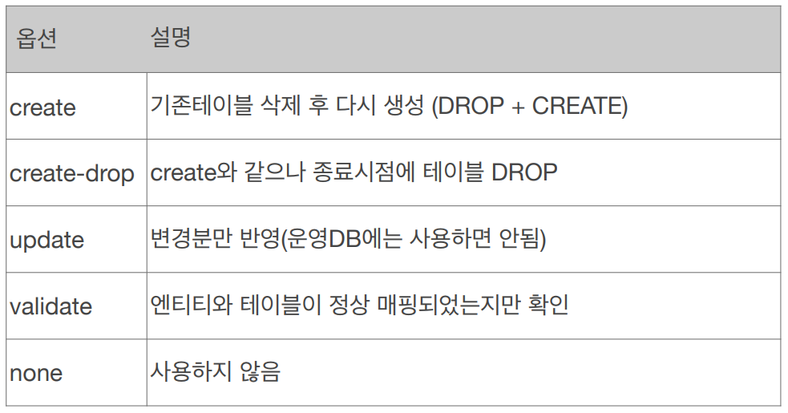

# 📙 JPA 학습
<p>자바 OMR 표준 JPA 프로그래밍 - 기본편 / 김영한</p>
<a href="https://www.inflearn.com/course/ORM-JPA-Basic/dashboard">강의 바로가기</a>

### 커리큘럼
1. JPA소개
    1. SQL 중심적인 개발의 문제점
    2. JPA소개
2. JPA 시작하기
    1. Hello JPA - 프로젝트 생성
    2. Hello JPA - 애플리케이션 개발
3. 영속성 관리 - 내부 동작 방식
    1. 영속성 컨텍스트 1
    2. 영속성 컨텍스트 2
    3. 플러시
    4. 준영속 상태
    5. 정리
4. 엔티티 매핑
    1. 객체와 테이블 매핑
    2. 데이터베이스 스키마 자동 생성
    3. 필드와 컬럼매핑
    4. 기본키 매핑
    5. 실전예제 1 - 요구사항 분석과 기본 매핑


   </br>


## 1. JPA소개
### 1) SQL 중심적인 개발의 문제점
1. 무한반복, 지루한 코드
2. 패러다임의 불일치 : 객체 vs 관계형데이터베이스
    * 객체는 참조를 사용 : member.getTeam()
    * 테이블은 외래키를 사용 : join on m.team_id = t.team_id
### 2) JPA소개
* Java Persistence API
* 자바 진영의 **ORM** 기술 표준
    * Object-relational mapping(객체 관계 매핑)
    * 객체는 객체대로 설계
    * 관계형 데이터베이스는 관계형 데이터베이스대로 설계
    * ORM 프레임워크가 중간에서 매핑
    * 대중적인 언어에는 대부분 ORM 기술이 존재
* JPA는 애플리케이션과 JDBC 사이에서 동작
* JPA는 표준 명세

## 2. JPA 시작하기
### 1) Hello JPA - 프로젝트 생성
* h2, 메이븐 사용
### 2) Hello JPA - 애플리케이션 개발
* 엔티티매니저팩토리는 하나만 생성해서 애플리케이션 전체에서 공유
* 엔티티매니저는 쓰레드 간에 공유X (사용하고 버려야 함)
* JPA의 모든데이터변경은 트랜잭션 안에서 실행

**JPQL**
* 가장 단순한 조회 방법
  * EntityManager.find()
  * 객체그래프탐색(a.getB().getC())
* JPA는 SQL을 추상화한 JPQL이라는 객체지향 쿼리언어 제공
* SQL과 문법유사, SELECT, FROM, WHERE, GROUP BY, HAVING, JOIN 지원
* JPQL은 엔티티객체를 대상으로 쿼리
* SQL은 데이터베이스테이블을 대상으로 쿼리

## 3. 영속성 관리 - 내부 동작 방식
### 1) 영속성 컨텍스트 1
* 영속성 컨텍스트
  * JPA를 이해하는데 가장 중요한 용어
  * “엔티티를 영구 저장하는 환경”이라는 뜻
  * EntityManager.persist(entity);
</br>
  
**[ 엔티티의 생명주기 ]**

  ```
  • 비영속 (new/transient) : 영속성 컨텍스트와 전혀 관계가 없는 새로운 상태
  • 영속 (managed) : 영속성 컨텍스트에 관리되는 상태
  • 준영속 (detached) : 영속성 컨텍스트에 저장되었다가 분리된 상태
  • 삭제 (removed) : 삭제된 상태
```

### 2) 영속성 컨텍스트 2
[img_1.png](img_1.png)

### 3) 플러시
* 영속성 컨텍스트의 변경내용을 데이터베이스에 반영
* 변경 감지 </br>
  → 수정된 엔티티 쓰기 지연 SQL 저장소에 등록 </br>
  → 쓰기 지연 SQL 저장소의 쿼리를 데이터베이스에 전송 (등록, 수정, 삭제 쿼리)
* 영속성 컨텍스트를 비우지 않음
* 영속성 컨텍스트의 변경내용을 데이터베이스에 동기화
* 트랜잭션이라는 작업 단위가 중요 -> 커밋 직전에만 동기화 하면 됨
### 4) 준영속 상태
* 영속 -> 준영속
* 영속 상태의 엔티티가 영속성 컨텍스트에서 분리(detached)  
* 영속성 컨텍스트가 제공하는 기능을 사용 못함
* 준영속 상태로 만드는 방법
  * em.detach(entity) : 특정 엔티티만 준영속 상태로 전환
  * em.clear() : 영속성 컨텍스트를 완전히 초기화
  * em.close() : 영속성 컨텍스트를 종료
### 5) 정리

## 4. 엔티티 매핑
### 1) 객체와 테이블 매핑
* 엔티티 매핑
  * 객체와테이블매핑: @Entity, @Table
  * 필드와컬럼매핑: @Column
  * 기본키매핑: @Id
  * 연관관계매핑: @ManyToOne,@JoinColumn
### 2) 데이터베이스 스키마 자동 생성
* DDL을 애플리케이션 실행시점에 자동생성
* 테이블중심 -> 객체중심
* 데이터베이스 방언을 활용해서 데이터베이스에 맞는 적절한 DDL 생성
* 이렇게 생성된 DDL은 개발 장비에서만 사용
* 생성된 DDL은 운영서버에서는 사용하지 않거나, 적절히다듬은 후 사용
 
**데이터베이스 스키마 자동 생성 - 속성**


**데이터베이스 스키마 자동 생성 - 주의**
* `운영장비에는절대 create, create-drop, update 사용하면 안됨`
* 개발초기단계는 create 또는 update
* 테스트서버는 update 또는 validate
* 스테이징과운영서버는 validate 또는 none
### 3) 필드와 컬럼매핑
### 4) 기본키 매핑
### 5) 실전예제 1 - 요구사항 분석과 기본 매핑