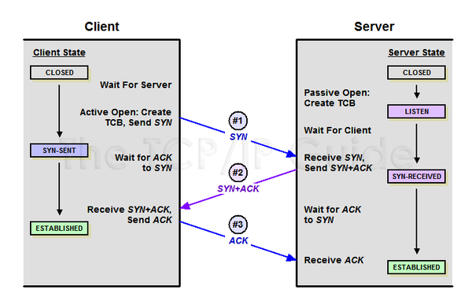
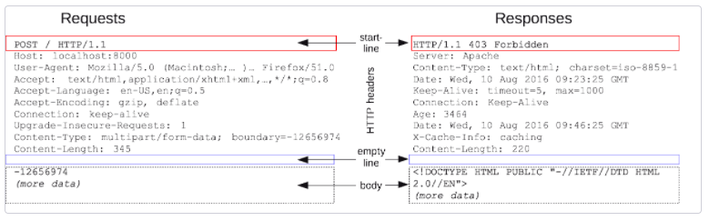

# 📙HTTP 학습
<p>모든 개발자를 위한 HTTP 웹 기본 지식 / 김영한</p>
<a href="https://www.inflearn.com/course/http-%EC%9B%B9-%EB%84%A4%ED%8A%B8%EC%9B%8C%ED%81%AC/dashboard">강의 바로가기</a>


### 커리큘럼
1. 인터넷 네트워크
    1. 인터넷 통신
    2. IP(인터넷 프로토콜)
    3. TCP, UDP
    4. PORT
    5. DNS
2. URI와 웹 브라우저 요청 흐름
    1. URI
    2. 웹브라우저 요청 흐름
3. HTTP 기본
    1. 모든것이 HTTP
    2. 클라이언트 서버 구조
    3. Stateful, Stateless
    4. 비연결성(connectionless)
    5. HTTP메시지
4. HTTP 메서드
    1. HTTP API를 만들어보자
    2. HTTP 메서드 - GET, POST
    3. HTTP 메서드 - PUT, PATCH, DELETE
    4. HTTP 메서드의 속성
5. HTTP 메서드 활용
    1. 클라이언트에서 서버로 데이터 전송
    2. HTTP API 설계 예시
6. HTTP 상태코드
    1. HTTP 상태코드 소개
    2. 2xx - 성공
    3. 3xx - 리다이렉션1
    4. 3xx - 리다이렉션2
    5. 4xx - 클라이언트 오류, 5xx - 서버오류
7. HTTP 헤더1 - 일반헤더
    1. HTTP 헤더 개요
    2. 표현
    3. 콘텐츠 협상
    4. 전송방식
    5. 일반정보
    6. 특별한 정보
    7. 인증
    8. 쿠키
8. HTTP 헤더2 - 캐시와 조건부 요청
   1. 캐시 기본 동작
   2. 검증헤더와 조건부 요청1
   3. 검증헤더와 조건부 요청2
   4. 캐시와 조건부 요청 헤더
   5. 프록시 캐시
   6. 캐시무효화
</br>
</br>

## 1. 인터넷 네트워크
### 1) 인터넷 통신
### 2) IP(인터넷 프로토콜)
* 역할
   * 지정한 IP주소에 데이터 전달
   * 패킷(Packet)이라는 통신 단위로 데이터 전달

* IP프로토콜 한계 -> TCP프로토콜로 해결
  * 비연결성 : 패킷을 받을 대상이 없거나 서비스 불능상태여도 전송
  * 비신뢰성 : 중간에 패킷이 사라질 수도, 패킷이 순서대로 안올 수도 있음
  * 프로그램 구분 : 같은 IP를 사용하는 서버에서 통신하는 애플리케이션이 둘 이상이면?
### 3) TCP, UDP
* 인터넷 프로토콜 스택의 4계층
   * 애플리케이션 계층 - HTTP, FTP / 프로그램이 Hello, world! 메세지 생성 -> SOCKET 라이브러리를 통해 전달
   * 전송 계청 - TCP, UDP / TCP 정보생성, 메세지 데이터 포함
   * 인터넷 계층 -IP / IP 패킷 생성, TCP 데이터 포함
   * 네트워크 인터페이스 계층 / LAN카드를 통해 서버에 전달


**TCP**
* TCP 특징(전송제어 프로토콜, Transmission Control Protocol)
  * 연결지향
  * 데이터 전달 보증
  * 순서 보장
  * 신뢰할 수 있는 프로토콜
  * 현재는 대부분 TCP 사용
* TCP의 3-way Handshaking 과정


**UDP**
* UDP 특징(사용자 데이터그램 프로토콜, User Datagram Protocol)
  * 기능이 거의 없음(하얀도화지)
  * 연결지향 - TCP 3 way handshake X
  * 데이터 전달 보증 X
  * 순서 보장 X
  * 단순하고 빠름
  * 정리 : IP와 거의 같음. +PORT +체크섬 정도만 추가. 애플리케이션에서 추가 작업 필요
### 4) PORT
* PORT : 같은 IP내에서 프로세스 구분
* IP가 아파트라면 PORT는 몇동 몇호
### 5) DNS
* DNS (도메인 네임 시스템, Domain Name System)
  * 전화번호부
  * 도메인 명을 IP 주소로 변환
</br>

## 2. URI와 웹 브라우저 요청 흐름
### 1) URI(Uniform Resource Identifier)
* URI : URI는 로케터(locator), 이름(name) 또는 둘 다 추가로 분류될 수 있다.
* Uniform : 리소스 식별하는 통일된 방식
* Resource : 자원, URI로 식별할 수 있는 모든 것(제한없음)
* Identifier : 다른 항목과 구분하는데 필요한 정보
* URL / URN : 위치는 변할 수 있지만, 이름은 변하지 않음
  * URN 이름만으로 실제 리소스를 찾을 수 있는 방법이 보편화 되지 않음

**URI 문법**</br>
```scheme://[userinfo@]host[:port][/path][?query][#fragment]```</br>
```https://www.google.com:443/search?q=hell&hl=ko```
* 프로토콜(https)
  * 주로 프로토콜 사용
  * 프로토콜 : 어떤 방식으로 자원에 접근할 것인가 하는 약속 규칙 ex) http, https, ftp 등등
  * http는 80포트, https는 443포트를 주로 사용, 포트는 생략가능
  * https는 http에 보안 추가(HTTP Secure)
* 호스트명(www.google.com)
  * 도메인명 또는 IP주소를 직접 사용가능
* 포트번호(443)
* 패스(/search)
  * 리소스 경로(path), 계층적 구조
* 쿼리 파라미터(q=hello&hl=ko)
  * key=value 형태
  * ?로 시작, &로 추가 기능
  * query parameter, query string 등으로 불림, 웹서버에 제공하는 파리미터 문자 형태


### 2) 웹브라우저 요청 흐름
**HTTP 메시지 전송**</br>
1. 웹브라우저가 HTTP 메시지 생성

2. SOCKET 라이브러리를 통해 전달
   * A: TCP/IP 연결(IP,PORT)
   * B: 데이터 전달
3. TCP/IP 패킷 생성, HTTP 메시지 포함
</br>

## 3. HTTP 기본
### 1) 모든것이 HTTP
* HTTP/1.1 1997년 : 가장 많이 사용, 가장 중요한 버전
* 기반 프로토콜
  * TCP : HTTP/1.1, HTTP/2
  * UDP : HTTP/3
* HTTP 특징
  * 클라이언트 서버 구조
  * 무상태 프로토콜(스테이스리스), 비연결성
  * HTTP 메시지
  * 단순함, 확장가능
### 2) 클라이언트 서버 구조
* Request Response 구조
* 클라이언트는 서버 요청을 보내고, 응답을 대기
* 서버가 요청에 대한 결과를 만들어서 응답
### 3) Stateful, Stateless
* 서버가 클라이언트의 상태를 보존X
* 장점 : 서버 확장성 높음(스케일 아웃)
* 단점 : 클라이언트가 추가 데이터 전송
* Stateful, Stateless 차이
  * 상태유지 : 중간에 다른점원으로 바뀌면 안됨
  * 무상태 : 중간에 다른점원으로 바뀌어도 됨
  * 무상태는 응답 서버를 쉽게 바꿀 수 있음 -> 무한한 서버 증설 가능
* Stateless 실무 한계
  * 모든 것을 무상태로 설꼐할 수 있는 경우도 있고 없는 경우도 있음
  * 무상태 : 단순 서비스 소개화면, 상태유지 : 로그인
  * 로그인한 사용자의 경우 로그인 했다는 상태를 서버에 유지
  * 일반적으로 브라우저 쿠키와 서버 세션등을 사용해서 상태 유지
  * 상태 유지는 최소한만 사용
  * 데이터를 많이 사용
### 4) 비연결성(connectionless)
  **비연결성**
* HTTP는 기본이 연결을 유지하지 않는 모델
* 일반적으로 초단위 이하의 빠른 속도로 응답
* 1시간 동안 수천명이 서비스를 사용해도 실제 서버에서 동시에 처리하는 요청의 수십개 이하로 매우 적음
* 서버 자원을 매우 효율적으로 사용할 수 있음
</br>

**비연결성 한계와 극복**
* TCP/IP 연결을 새로 맺어야 함 - 3way handshake 시간 추가
* 웹 브라우저로 사이트를 요청하면 HTML 분만아니라 자바스크립트, css, 추가 이미지 등 수만은 자원이 함께 다운로드
* 지금은 HTTP 지속연결(Persistent Connections)로 문제해결
* HTTP/2, HTTP/3에서 더 많은 최적화

### 5) HTTP 메시지
* HTTP는 단순함
* HTTP 메시지도 매우 단순
* 크게 성공하는 표준기술은 단순하지만 확장가능한 기술
 </br>


</br>

**시작라인 요청 메시지**
* HTTP 메서드(GET, POST 등)
* 요청 대상(/search?q=hello&hl=ko, 절대경로 '/'로 시작)
* HTTP Version
</br>

**시작라인 응답 메시지**
* HTTP 버전
* HTTP 상태코드 : 요청 성공, 실패를 나타냄
  * 200 : 성공, 400 : 클라이언트 요청 오류, 500 : 서버 내부 오류)
* 이유 문구 : 사람이 이해할 수 있는 짧은 상태 코드 설명 글
  </br>

**HTTP 헤더 용도**
* HTTP 전송에 필요한 모든 부가정보 ex) 메시지 바디의 내용, 크기, 압축, 인증 등등
* 표준 헤더가 너무 많음
* 필요시 임의의 헤더 추가 기능
  </br>

**HTTP 바디 용도**
* 실제 전송할 데이터
* HTML 문서, 이미지, JSON 등 byte로 표현할 수 있는 모든 데이터 전송 가능
  </br>

## 4. HTTP 메서드
### 1) HTTP API를 만들어보자
* API URI 설계 : 리소시 식별
  * ```회원``` 목록 조회
  * ```회원``` 조회
  * ```회원``` 등록
  * ```회원``` 수정
  * ```회원``` 삭제
### 2) HTTP 메서드 - GET, POST
* HTTP 주요 메서드
  * GET : 리소스 조회
  * POST : 요청데이터 처리, 주로 등록에 사용
  * PUT : 리소스를 대체, 해당 리소스가 없으면 생성
  * PATCH : 리소스 부분 변경
  * DELETE : 리소스 삭제
* HTTP 기타 메서드
  * HEAD : GET과 동일하지만 메시지 부분을 제외하고, 상태줄과 헤더만 반환
  * OPTIONS : 대상 리소스에 대한 통신 가능 옵션(메서드)을 설명(주로 CORS에서 사용)
  * CONNECT : 대상 자원으로 식별되는 서버에 대한 터널을 설정
  * TRACE : 대상 리소스에 대한 경로를 따라 메시지 루프백 테스트를 수행
  </br>
  
**GET**
* 리소스 조회
* 서버에 전달하고  싶은 데이터는 query(쿼리 파라미터, 쿼리 스트링)를 통해서 전달
* 메시지 바디를 사용해서 데이터를 전달할 수 있지만, 지원하지 않은 곳이 많아서 권장하지 않음

**POST**
* 새 리소스 생성(등록), 요청 데이터 처리
* 메시지 바디를 통해 서버로 요청 데이터 전달
* 서버는 요청 데이터를 처리
  * 메시지 바디를 통해 들어온 데이터를 처리하는 모든 기능을 수행
* 주로 전달된 데이터로 신규 리소스 등록, 프로세스 처리에 사용
* 리소스 URI에 POST 요청이 오면 요청 데이터를 어떻게 처리할지 리소스마다 따로 정해야 함 -> 정해진 것이 없음

### 3) HTTP 메서드 - PUT, PATCH, DELETE
**PUT**
* 리소스를 대체
  * 리소스가 있으면 ```완전히```대체, 없으면 생성
* 중요! 클라이언트가 리소스를 식별
  * 클라이언트가 리소스 위치를 알고 URI 지정
  * POST와 차이점

**PATCH**
* 리소스를 부분적으로 변경

**DELETE**
* 리소스를 제거

### 4) HTTP 메서드의 속성
* 안전(Sage Methods) : 호출해도 리소스를 변경하지 않음
* 멱등(Idempotent Methods)
  * 한번 호출하든 100번 호출하든 결과가 똑같음
    * GET : 한번 조회해도, 두번 조회해도 결과가 조회됨
    * PUT : 결과를 대체, 같은 요청을 여러번 해도 최종겨로가는 같음
    * DELETE : 같은 요청을 여러번 해도 삭제된 결과는 같음
    * <div style="color: red">POST : 멱등이 아님! 두번 호출하면 같은 결제가 중복해서 발생함</div>
  * 활용
    * 자동 복구 메커니즘
    * 서버가 TIMEOUT 등으로 정상 응답을 못주었을 때, 클라이언트가 같은 요청을 다시 해도 됨
* 캐시가능(Cacheable Methods)
  * GET, HEAD, POST, PATCH 캐시가능
  * 실제로는 GET, HEAD 정도만 캐시로 사용
    * POST, PATCH는 본문 내용까지 캐시 키로 고려해야 하는데, 구현이 어려움


## 5. HTTP 메서드 활용
### 1) 클라이언트에서 서버로 데이터 전송
**데이터 전달 방식**
  * 쿼리 파라미터를 통한 데이터 전송
    * GET
    * 주로 정렬 필터(검색어)
  * 메시지 바디를 통한 데이터 전송
    * POST, PUT, PATCH
    * 회원 가입, 
### 2) HTTP API 설계 예시