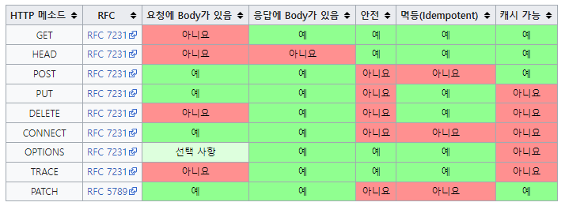

# 📙HTTP 학습
<p>모든 개발자를 위한 HTTP 웹 기본 지식 / 김영한</p>
<a href="https://www.inflearn.com/course/http-%EC%9B%B9-%EB%84%A4%ED%8A%B8%EC%9B%8C%ED%81%AC/dashboard">강의 바로가기</a>


### 커리큘럼
1. 인터넷 네트워크
    1. 인터넷 통신
    2. IP(인터넷 프로토콜)
    3. TCP, UDP
    4. PORT
    5. DNS
2. URI와 웹 브라우저 요청 흐름
    1. URI
    2. 웹브라우저 요청 흐름
3. HTTP 기본
    1. 모든것이 HTTP
    2. 클라이언트 서버 구조
    3. Stateful, Stateless
    4. 비연결성(connectionless)
    5. HTTP메시지
4. HTTP 메서드
    1. HTTP API를 만들어보자
    2. HTTP 메서드 - GET, POST
    3. HTTP 메서드 - PUT, PATCH, DELETE
    4. HTTP 메서드의 속성
5. HTTP 메서드 활용
    1. 클라이언트에서 서버로 데이터 전송
    2. HTTP API 설계 예시
6. HTTP 상태코드
    1. HTTP 상태코드 소개
    2. 2xx - 성공
    3. 3xx - 리다이렉션1
    4. 3xx - 리다이렉션2
    5. 4xx - 클라이언트 오류, 5xx - 서버오류
7. HTTP 헤더1 - 일반헤더
    1. HTTP 헤더 개요
    2. 표현
    3. 콘텐츠 협상
    4. 전송방식
    5. 일반정보
    6. 특별한 정보
    7. 인증
    8. 쿠키
8. HTTP 헤더2 - 캐시와 조건부 요청
   1. 캐시 기본 동작
   2. 검증헤더와 조건부 요청1
   3. 검증헤더와 조건부 요청2
   4. 캐시와 조건부 요청 헤더
   5. 프록시 캐시
   6. 캐시무효화
</br>
</br>

## 1. 인터넷 네트워크
### 1) 인터넷 통신
### 2) IP(인터넷 프로토콜)
* 역할
   * 지정한 IP주소에 데이터 전달
   * 패킷(Packet)이라는 통신 단위로 데이터 전달

* IP프로토콜 한계 -> TCP프로토콜로 해결
  * 비연결성 : 패킷을 받을 대상이 없거나 서비스 불능상태여도 전송
  * 비신뢰성 : 중간에 패킷이 사라질 수도, 패킷이 순서대로 안올 수도 있음
  * 프로그램 구분 : 같은 IP를 사용하는 서버에서 통신하는 애플리케이션이 둘 이상이면?
### 3) TCP, UDP
* 인터넷 프로토콜 스택의 4계층
   * 애플리케이션 계층 - HTTP, FTP / 프로그램이 Hello, world! 메세지 생성 -> SOCKET 라이브러리를 통해 전달
   * 전송 계청 - TCP, UDP / TCP 정보생성, 메세지 데이터 포함
   * 인터넷 계층 -IP / IP 패킷 생성, TCP 데이터 포함
   * 네트워크 인터페이스 계층 / LAN카드를 통해 서버에 전달


**TCP**
* TCP 특징(전송제어 프로토콜, Transmission Control Protocol)
  * 연결지향
  * 데이터 전달 보증
  * 순서 보장
  * 신뢰할 수 있는 프로토콜
  * 현재는 대부분 TCP 사용
* TCP의 3-way Handshaking 과정


**UDP**
* UDP 특징(사용자 데이터그램 프로토콜, User Datagram Protocol)
  * 기능이 거의 없음(하얀도화지)
  * 연결지향 - TCP 3 way handshake X
  * 데이터 전달 보증 X
  * 순서 보장 X
  * 단순하고 빠름
  * 정리 : IP와 거의 같음. +PORT +체크섬 정도만 추가. 애플리케이션에서 추가 작업 필요
### 4) PORT
* PORT : 같은 IP내에서 프로세스 구분
* IP가 아파트라면 PORT는 몇동 몇호
### 5) DNS
* DNS (도메인 네임 시스템, Domain Name System)
  * 전화번호부
  * 도메인 명을 IP 주소로 변환
</br>

## 2. URI와 웹 브라우저 요청 흐름
### 1) URI(Uniform Resource Identifier)
* URI : URI는 로케터(locator), 이름(name) 또는 둘 다 추가로 분류될 수 있다.
* Uniform : 리소스 식별하는 통일된 방식
* Resource : 자원, URI로 식별할 수 있는 모든 것(제한없음)
* Identifier : 다른 항목과 구분하는데 필요한 정보
* URL / URN : 위치는 변할 수 있지만, 이름은 변하지 않음
  * URN 이름만으로 실제 리소스를 찾을 수 있는 방법이 보편화 되지 않음

**URI 문법**</br>
```scheme://[userinfo@]host[:port][/path][?query][#fragment]```</br>
```https://www.google.com:443/search?q=hell&hl=ko```
* 프로토콜(https)
  * 주로 프로토콜 사용
  * 프로토콜 : 어떤 방식으로 자원에 접근할 것인가 하는 약속 규칙 ex) http, https, ftp 등등
  * http는 80포트, https는 443포트를 주로 사용, 포트는 생략가능
  * https는 http에 보안 추가(HTTP Secure)
* 호스트명(www.google.com)
  * 도메인명 또는 IP주소를 직접 사용가능
* 포트번호(443)
* 패스(/search)
  * 리소스 경로(path), 계층적 구조
* 쿼리 파라미터(q=hello&hl=ko)
  * key=value 형태
  * ?로 시작, &로 추가 기능
  * query parameter, query string 등으로 불림, 웹서버에 제공하는 파리미터 문자 형태


### 2) 웹브라우저 요청 흐름
**HTTP 메시지 전송**</br>
1. 웹브라우저가 HTTP 메시지 생성

2. SOCKET 라이브러리를 통해 전달
   * A: TCP/IP 연결(IP,PORT)
   * B: 데이터 전달
3. TCP/IP 패킷 생성, HTTP 메시지 포함
</br>

## 3. HTTP 기본
### 1) 모든것이 HTTP
* HTTP/1.1 1997년 : 가장 많이 사용, 가장 중요한 버전
* 기반 프로토콜
  * TCP : HTTP/1.1, HTTP/2
  * UDP : HTTP/3
* HTTP 특징
  * 클라이언트 서버 구조
  * 무상태 프로토콜(스테이스리스), 비연결성
  * HTTP 메시지
  * 단순함, 확장가능
### 2) 클라이언트 서버 구조
* Request Response 구조
* 클라이언트는 서버 요청을 보내고, 응답을 대기
* 서버가 요청에 대한 결과를 만들어서 응답
### 3) Stateful, Stateless
* 서버가 클라이언트의 상태를 보존X
* 장점 : 서버 확장성 높음(스케일 아웃)
* 단점 : 클라이언트가 추가 데이터 전송
* Stateful, Stateless 차이
  * 상태유지 : 중간에 다른점원으로 바뀌면 안됨
  * 무상태 : 중간에 다른점원으로 바뀌어도 됨
  * 무상태는 응답 서버를 쉽게 바꿀 수 있음 -> 무한한 서버 증설 가능
* Stateless 실무 한계
  * 모든 것을 무상태로 설꼐할 수 있는 경우도 있고 없는 경우도 있음
  * 무상태 : 단순 서비스 소개화면, 상태유지 : 로그인
  * 로그인한 사용자의 경우 로그인 했다는 상태를 서버에 유지
  * 일반적으로 브라우저 쿠키와 서버 세션등을 사용해서 상태 유지
  * 상태 유지는 최소한만 사용
  * 데이터를 많이 사용
### 4) 비연결성(connectionless)
  **비연결성**
* HTTP는 기본이 연결을 유지하지 않는 모델
* 일반적으로 초단위 이하의 빠른 속도로 응답
* 1시간 동안 수천명이 서비스를 사용해도 실제 서버에서 동시에 처리하는 요청의 수십개 이하로 매우 적음
* 서버 자원을 매우 효율적으로 사용할 수 있음
</br>

**비연결성 한계와 극복**
* TCP/IP 연결을 새로 맺어야 함 - 3way handshake 시간 추가
* 웹 브라우저로 사이트를 요청하면 HTML 분만아니라 자바스크립트, css, 추가 이미지 등 수만은 자원이 함께 다운로드
* 지금은 HTTP 지속연결(Persistent Connections)로 문제해결
* HTTP/2, HTTP/3에서 더 많은 최적화

### 5) HTTP 메시지
* HTTP는 단순함
* HTTP 메시지도 매우 단순
* 크게 성공하는 표준기술은 단순하지만 확장가능한 기술
 </br>


</br>

**시작라인 요청 메시지**
* HTTP 메서드(GET, POST 등)
* 요청 대상(/search?q=hello&hl=ko, 절대경로 '/'로 시작)
* HTTP Version
</br>

**시작라인 응답 메시지**
* HTTP 버전
* HTTP 상태코드 : 요청 성공, 실패를 나타냄
  * 200 : 성공, 400 : 클라이언트 요청 오류, 500 : 서버 내부 오류)
* 이유 문구 : 사람이 이해할 수 있는 짧은 상태 코드 설명 글
  </br>

**HTTP 헤더 용도**
* HTTP 전송에 필요한 모든 부가정보 ex) 메시지 바디의 내용, 크기, 압축, 인증 등등
* 표준 헤더가 너무 많음
* 필요시 임의의 헤더 추가 기능
  </br>

**HTTP 바디 용도**
* 실제 전송할 데이터
* HTML 문서, 이미지, JSON 등 byte로 표현할 수 있는 모든 데이터 전송 가능
  </br>

## 4. HTTP 메서드
### 1) HTTP API를 만들어보자
* API URI 설계 : 리소시 식별
  * ```회원``` 목록 조회
  * ```회원``` 조회
  * ```회원``` 등록
  * ```회원``` 수정
  * ```회원``` 삭제
### 2) HTTP 메서드 - GET, POST
* HTTP 주요 메서드
  * GET : 리소스 조회
  * POST : 요청데이터 처리, 주로 등록에 사용
  * PUT : 리소스를 대체, 해당 리소스가 없으면 생성
  * PATCH : 리소스 부분 변경
  * DELETE : 리소스 삭제
* HTTP 기타 메서드
  * HEAD : GET과 동일하지만 메시지 부분을 제외하고, 상태줄과 헤더만 반환
  * OPTIONS : 대상 리소스에 대한 통신 가능 옵션(메서드)을 설명(주로 CORS에서 사용)
  * CONNECT : 대상 자원으로 식별되는 서버에 대한 터널을 설정
  * TRACE : 대상 리소스에 대한 경로를 따라 메시지 루프백 테스트를 수행
  </br>
  
**GET**
* 리소스 조회
* 서버에 전달하고  싶은 데이터는 query(쿼리 파라미터, 쿼리 스트링)를 통해서 전달
* 메시지 바디를 사용해서 데이터를 전달할 수 있지만, 지원하지 않은 곳이 많아서 권장하지 않음

**POST**
* 새 리소스 생성(등록), 요청 데이터 처리
* 메시지 바디를 통해 서버로 요청 데이터 전달
* 서버는 요청 데이터를 처리
  * 메시지 바디를 통해 들어온 데이터를 처리하는 모든 기능을 수행
* 주로 전달된 데이터로 신규 리소스 등록, 프로세스 처리에 사용
* 리소스 URI에 POST 요청이 오면 요청 데이터를 어떻게 처리할지 리소스마다 따로 정해야 함 -> 정해진 것이 없음

### 3) HTTP 메서드 - PUT, PATCH, DELETE
**PUT**
* 리소스를 대체
  * 리소스가 있으면 ```완전히```대체, 없으면 생성
* 중요! 클라이언트가 리소스를 식별
  * 클라이언트가 리소스 위치를 알고 URI 지정
  * POST와 차이점

**PATCH**
* 리소스를 부분적으로 변경

**DELETE**
* 리소스를 제거

### 4) HTTP 메서드의 속성
* 안전(Sage Methods) : 호출해도 리소스를 변경하지 않음
* 멱등(Idempotent Methods)
  * 한번 호출하든 100번 호출하든 결과가 똑같음
    * GET : 한번 조회해도, 두번 조회해도 결과가 조회됨
    * PUT : 결과를 대체, 같은 요청을 여러번 해도 최종겨로가는 같음
    * DELETE : 같은 요청을 여러번 해도 삭제된 결과는 같음
    * <div style="color: red">POST : 멱등이 아님! 두번 호출하면 같은 결제가 중복해서 발생함</div>
  * 활용
    * 자동 복구 메커니즘
    * 서버가 TIMEOUT 등으로 정상 응답을 못주었을 때, 클라이언트가 같은 요청을 다시 해도 됨
* 캐시가능(Cacheable Methods)
  * GET, HEAD, POST, PATCH 캐시가능
  * 실제로는 GET, HEAD 정도만 캐시로 사용
    * POST, PATCH는 본문 내용까지 캐시 키로 고려해야 하는데, 구현이 어려움



## 5. HTTP 메서드 활용
### 1) 클라이언트에서 서버로 데이터 전송
**데이터 전달 방식**
  * 쿼리 파라미터를 통한 데이터 전송
    * GET
    * 주로 정렬 필터(검색어)
  * 메시지 바디를 통한 데이터 전송
    * POST, PUT, PATCH
    * 회원 가입, 상품 주문, 리소스 등록, 리소스 변경
**4가지 상황**
  * 정적데이터 조회
  * 동적 데이터 조회 : 주로 검색, 게시판 목록에서 정렬 필터(검색어)
  * HTML Form을 통한 데이터 전송 : 회원가입, 상품주문, 데이터 변경
    * **HTML Form submit 시 POST 전송** / HTML Form은 GET 전송도 가능
    * **application/x-www-form-** 인코딩 해서 넘어감
      * form의 내용을 메시지 바디를 통해 전송(key=value, 쿼리파라미터 형식)
      * 전송데이터를 Url encoding 처리 ex) abc김 -> abc%EA%B9%80
    * **multipart/form-data**
      * 파일 업로드 같은 바이너리 데이터 전송 시 사용
      * 다른 종류의 여러 파일과 폼의 내용 함께 전송 가능
  * **HTTP API를 통한 데이터 전송** : 서버 to 서버, 앱클라이언트, 웹 클라이언트(Ajax)
    * 서버 to 서버
    * 앱클라이언트
    * 웹클라이언트 : HTML에서 Form 전송 대신 자바 스크립트를 통한 통신에 사용(Ajax)
    * POST, PUT, PATCH : 메시지 바디를 통해 데이터 전송
    * GET : 조회 쿼리 파라미터로 데이터 전달
    * Content-Type : application/json을 주로 사용
### 2) HTTP API 설계 예시
**POST - 신규 자원 등록 특징**
  * 클라이언트는 등록된 리소소의 URI를 모름 ex) POST /members
  * 서버가 새로 등록된 리소스 URI를 생성함
  * 컬렉션(Collection)
    * 서버가 관리하는 리소스 디렉토리
    * 서버가 리소스의 URI를 생성하고 관리
    * 여기서 컬렉션은 /members
</br>
    
**PUT - 신규 자원 등록 특징**
* 클라이언트가 리소스 URI를 알고 있어야 함 ex)PUT /file.star.jpa
* 클라이언트가 직접 리소소의 URI를 지정
* 스토어(Store)
  * 클라이언트가 관리하는 리소스 저장소
  * 클라이언트가 리소스의 URI를 알고 관리
  * 여기서 스토어는 /file
</br>

**HTML FORM 사용**
* `MTML FORM은 GET, POST만 지원`
* 컨트롤 URL
  * GET, POST만 지원하므로 제약이 있음
  * 이런 제약을 해결하기 위해 동사로 된 리소스 경로 사용
  * POST의 /new, /edit, /delete가 컨트롤 URI
  * HTTP 메서드로 해결하기 애매한 경우 사용(HTTP API 포함)

**참고하면 좋은 URI 설계 개념**</br>
`https://restfulapi.net/resource-naming/`
* 문서(document)
  * 단일개념(파일 하나, 객체 인스턴스, 데이터베이스 row) ex) /members/100, /files/star.jpg
* 컬렉션(collection)
  * 서버가 관리하는 리소스 디렉터리
  * 서버가 리소스의 URI를 생성하고 관리 ex) /members
* 스토어(store)
  * 클라이언트가 관리하는 자원 저장소
  * 클라이언트가 리소시의 URI를 알고 관리 ex) /files
* 컨트롤러(controller), 컨트롤 URI
  * 문서, 컬렉션, 스토어로 해결하기 어려운 추가 프로세스 실행
  * 동사를 직접사용 ex) /members/{id}/delete

## 6. HTTP 상태코드
### 1) HTTP 상태코드 소개
* 상태코드 : 클라이언트가 보낸 요청의 처리 상태를 응답에서 알려주는 기능
  * `1xx(Informational)` : 요청이 수신되어 처리중(거의 사용하지 않음)
  * `2xx(Successful)` : 요청 정상 처리
  * `3xx(Redirection)` : 요청을 완료하려면 추가 행동이 필요
  * `4xx(Client Error)` : 클라이언트 오류, 잘못된 문법등으로 서버가 요청을 수행할 수 없음
  * `5xx(Server Error)` : 서버 오류, 서버가 정상 요청을 처리하지 못함
### 2) 2xx - 성공
* `200 OK` : 요청성공
* `201 Created` : 요청 성공해서 새로운 리소스가 생성됨
  * 생성된 리소스는 응답의 Location 헤더 필드로 식별
* `202 Accepted` : 요청이 접수되었으나 처리가 완료되지 않았음
* `204 No Content` : 서버가 요청을 성공적으로 수행했지만, 응답페이로드 본문에 보낼 데이터가 없음
  * ex) 웹문서 편집기에서 save 버튼
  * save 버튼의 결과로 아무내용이 없어도됨, 같은화면을 유지
  * 결과 내용이 없어도 204 메시지만으로 성공을 인식
### 3) 3xx - 리다이렉션1

**리다이렉션**
* 웹브라우저는 3xx 응답의 결과에 Location 헤더가 있으면, Location 위치로 자동 이동
* 종류
    * 영구 리다이렉션 : 특정 리소스의 URI가 영구적으로 이동, 원래의 URL을 사용X, 검색엔진 등에서도 변경인지 ex) 301, 308
    * 일시 리다이렉션 : 일시적인 변경, 검색엔진 등에서 URL을 변경하면 안됨 ex) 주문 완료 후 주문 내역 화면으로 이동, 302, 307, 303
      * PRG(Post/Redirect/Get)이 후 리다이렉트 : URL이 이미 POST -> GET으로 리다이렉트 되어 새로고침해도 GET으로 결과 화면만 조회
    * 특수 리다이렉션 : 결과 대신 캐시를 사용 ex) 304

### 4) 3xx - 리다이렉션2
**3xx 요청을 완료하기 위해 유저 에이전트의 추가 조치 필요**
* `300 Multiple Choices` : 잘 사용하지 않음
* `301 Moved Permanently` : 리다이렉트 시 요청 메서드가 GET으로 변하고, 본문이 제거될 수 있음(MAY)
* `302 Found` : 리다이렉트 시 요청 메서드가 GET으로 변하고, 본문이 제거될 수 있음(MAY)
* `303 See Other` : 302와 기능은 같음, 리다이렉트 시 요청 메서드가 GET으로 변경
* `304 Not Modified` : 캐시를 목적으로 사용
  * 클라이언트에게 리소스가 수정되지 않았음을 알려준다. 따라서 클라이언트는 로컬PC에 저장된 캐시를 재사용(캐시로 리다이렉트)
  * 304응답은 응답에 메시지 바디를 포함하면 안됨(로컬 캐시를 사용해야함으로)
  * 조건부 GET, HEAD 요청시 사용
* `307 Temporary Redirect` : 302와 기능은 같음, 리다이렉트 시 요청 메서드와 본문 유지(요청 메서드를 변경하면 안됨. MUST NOT)
* `308 Permanent Redirect` : 301과 기능은 같음, 리다이렉트 시 요청 메서드와 분문 유지(처음 POST를 보내려면 리다이렉트)
</br>

`* 307, 303을 권장하지만 현실적으로 이미 많은 애플리케이션 라이브러리들이 302를 기본값으로 사용하고 있음`</br>
`* 자동 리다이렌션시에 GET으로 변해도 되면 그냥 302를 사용해도 큰문제 없음`

### 5) 4xx - 클라이언트 오류, 5xx - 서버오류
**4xx 클라이언트 오류**
* 클라이언트의 요청에 잘못된 문법등으로 서버가 요청을 수행할 수 없음
* 오류의 원인이 클라이언트에 있음
* 클라이언트가 이미 잘못된 요청, 데이터를 보내고 있기 때문에 똑같은 재시도가 실패함

* `400 Bad Request` : 요청구문, 메시지 등 오류, 클라이언트는 요청 내용을 다시 검토하고 보내야함
* `401 Unauthorized` : 클라이언트가 해당 리소스에 대한 인증이 필요함
  * 인증(Authentication) 되지 않음
  * 401 오류 발생시 응답에 WWW-Authenticate 헤더와 함께 인증 방법을 설명
    ```
    인증(Authentication) : 본인이 누구인지 확인(로그인)
    인가(AUthorization) : 권한부여(ADMIN 권한 처럼 특정 리소스에 접근할 수 있는 권한, 인증이 있어야 인가가 있음)
    ```
  * 오류메시지가 Unauthorized 이지만 인증 되지 않음
* `403 Forbidden` : 서버가 요청을 이해했지만 승인을 거부함
  * 주로 인증 자격 증명은 있지만 접근 권한이 불충분한 경우
  * ex) 어디민 등급이 아닌 사용자가 로그인은 했지만 어드민 등급의 리소스에 접근하는 경우
* `404 Not Found` : 요청 리소스를 찾을 수 없음
  * 요청 리소스가 서버에 없거나 클라이언트가 권한이 부족한 리소스에 접근할 때 해당 리소스를 숨기고 싶을 때
 
 </br>

**5xx 서버 오류**
* 서버 문제로 오류 발생
* 서버 문제가 있기 때문에 재시도 하면 성공할 수도 있음

* `500 Internal Server Error` : 서버 문제로 오류 발생, 애매하면 500오류
* `503 Service Unauailable` :  서비스 이용 불가
  * 서버가 일시적인 과부하 또는 예정된 작업으로 잠시 요청을 처리할 수 없음
  * Retry-After 헤더 필드로 얼마뒤에 복구되는 지 보낼 수도 있음
* `` : 