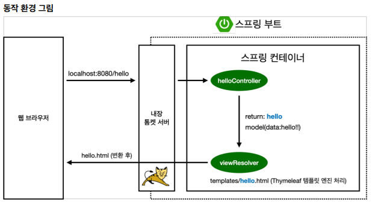
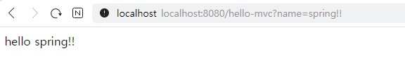
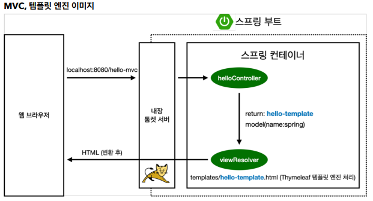
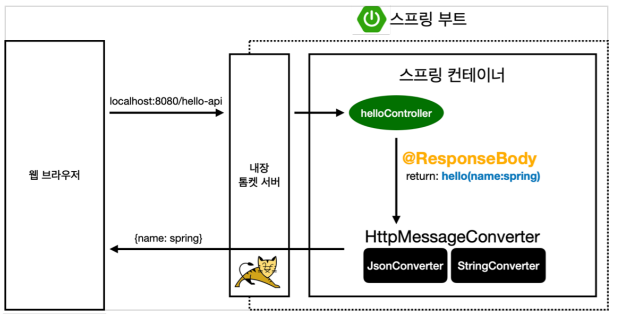

# 스프링 입문 강의 학습
<p>코드로 배우는 스프링 부트, 웹 MVC, DB 접근 기술 / 김영한</p>
<a href="https://www.inflearn.com/course/스프링-입문-스프링부트/dashboard">강의 바로가기</a>


### 커리큘럼
1. 프로젝트 환경설정
   1. 프로젝트 생성
   2. 라이브러리 살펴보기
   3. View 환경설정
   4. 빌드하고 실행하기
2. 스프링 웹개발 기초 
   1. 정적컨텐츠
   2. MVC와 템플릿 엔진
   3. API
3. 회원 관리 예제 - 백엔드 개발
   1. 비즈니스 요구사항 정리
   2. 회원 도메인과 리포지토리 만들기
   3. 회원 리포지토리 테스트 케이스 작성
   4. 회원 서비스 개발
   5. 회원 서비스 테스트
4. 스프링 빈과 의존관계
   1. 컴퓨넌트 스캔과 자동 의존관계 설정
   2. 자바 코드로 직접 스프링 빈 등록하기
5. 회원관리 예제 - 웹 MVC 개발
   1. 회원 웹 기능 - 홈화면 추가
   2. 회원 웹 기능 - 등록
   3. 회원 웹 기능 - 조회
6. 스프링 DB 접근 기술
   1. H2 데이터베이스 설치
   2. 순수 JDBC
   3. 스프링 통합 테스트
   4. 스프링 JdbcTemplate
   5. JPA
   6. 스프링 데이터 JPA
7. AOP
   1. AOP가 필요한 상황
   2. AOp 적용

---

## 1. 프로젝트 환경설정
### 1) 프로젝트 생성
스프링 부트 스타터에서 스프링 프로젝트 생성
https://start.spring.io/
</br>

### 2) 프로젝트 라이브러리
Gradle은 의존관계가 있는 라이브러리를 함께 다운로드
</br>
</br>

**스프링부트 라이브러리**
* spring-boot-starter-web
  * spring-boot-starter-tomcat: 톰캣(웹서버)
  * spring-webmvc: 스프링 웹 MVC
* spring-boot-starter(공통): 스프링 부터 + 스프링코어 + 로깅
  * spring-boot
    * spring-core
  * spring-boot-starter-logging
    * logback, slf4j
</br>
</br>

**테스트라이브러리**
* spring-boot-starter-test
  * junit: 테스트 프레임워크(최근 junit5까지 나와서 사용)
  * mockito: 목 라이브러리
  * assertj: 테스트 코드를 좀 더 편하게 작성하게 도와주는 라이브러리
  * spring-test: 스프링 통합 테스트 지원

### 3) View 환경설정
컨트롤러에서 리턴값으로 문자를 반환하면 viewResolver가 화면을 찾아 처리

* thymeleaf를 사용하기 위해 html 태그에 네임스페이스를 작성해 IDE가 타임리프를 인식하도록 한다.</br>
```<html xmlns:th="http://www.thymeleaf.org">```
* modelAttribute를 사용해 data를 thymeleaf로 view 화면에 보내준다</br>
```
public String hello(Model model) {
    model.addAttribute("data", "hello");
    return "hello";
}
```
hello.html</br>
```<p th:text="'안녕하세요. ' + ${data}" >안녕하세요. 손님</p>```

### 4) 빌드하고 실행하기


## 2. 스프링 웹개발 기초
### 1) 정적 컨텐츠
스프링부터 정적 컨턴츠 기능 </br>
https://docs.spring.io/spring-boot/docs/2.3.1.RELEASE/reference/html/spring-boot-features.html#boot-features-spring-mvc-static-content

### 2) MVC와 템플릿 엔진
Model, View, Controller</br>
Controller, Model</br>
```
public String helloMvc(@RequestParam("name") String name, Model model) {
    model.addAttribute("name", name);
    return "hello-template";
}
```

Controller와 Model을 통해 view에 값을 넘겨줌


spring이 Controll에서 viewResolver에 return 값으로 hello-template, model로 name값을 넘겨줌</br>
</br>

### 3) API
* ```@ResponseBody```를 사용하면 viewResolver를 사용하지 않고 HTTP의 Body에 문자내용을 직접반환(JSON으로)</br>
* viewResolver 대신 ```HttpMessageConverter```가 동작


## 3. 회원 관리 예제 - 백엔드 개발
### 1) 비즈니스 요구사항 정리
### 2) 회원 도메인과 리포지토리 만들기
### 3) 회원 리포지토리 테스트 케이스 작성
```
    public void clearStore() {
        store.clear();  //data clear
    }
```
```
    @AfterEach // 메소드가 끝난 후 실행(<-> @BeforEach)
    public void afterEach() {
        repository.clearStore();  //data clear
    }

    @Test
    public void save() {
        Member member = new Member();
        member.setName("spring"); //"spring"입력, member에 저장
        repository.save(member); //repository에 member저장

        Member result = repository.findById(member.getId()).get(); //result변수에 repository에서 아이디로 조회한 Member정보를 담는다
//        Assertions.assertEquals(member, result);
        Assertions.assertThat(member).isEqualTo(result); //member와 result 비교
    }
```
### 4) 회원 서비스 개발
```
//같은 이름이 있는 종복 회원X
Optional<Member> result = memberRepository.findByName(member.getName()); //Optional을 통해 유효성검사
result.ifPresent(m -> {      // .fiPresent : null인 경우에 default 값 반환 
    throw new IllegalArgumentException("중복된 이름 입니다.");
});
```
```
//같은 이름이 있는 종복 회원X
private void validateDuplicateMember(Member member) {   // Optionall 생략가능
    memberRepository.findByName(member.getName())
        .ifPresent(m -> {
            throw new IllegalArgumentException("중복된 이름 입니다.");
        });
}
```
### 5) 회원 서비스 테스트


## 4. 스프링 빈과 의존관계
### 1) 컴퓨넌트 스캔과 자동 의존관계 설정
**스프링 빈을 등록하는 2가지 방법**
* 컴포넌트 스캔과 자동 의존관계 설정
* 자바 코드로 직접 스프링 빈 등록하기
</br>
</br>

**컴포넌트 스캔 원리**
* @Component 애노테이션이 있으면 스프링 빈으로 자동 등록
* @Component 를 포함하는 다음 애노테이션도 스프링 빈으로 자동 등록</br>
```@Controller```
```@Service```
```@Repository```
</br>
</br>

**회원서비스 스프링 빈 등록**
* 생성자에 @Autowired를 사용하면 객체 생성 시점에 스프링 컨테이너에서 해당 스프링 빈을 찾아 주입
```
@Service
public class MemberService {
    private final MemberRepository memberRepository;
 
    @Autowired  
    public MemberService(MemberRepository memberRepository) {
        this.memberRepository = memberRepository;
    }
}
```


### 2) 자바 코드로 직접 스프링 빈 등록하기
* @Configuration 어노테이션을 이용하여 Bean을 생성 할 수 있음
```
@Configuration
public class SpringConfig {

    @Bean
    public MemberService memberService() {
        return new MemberService(memberRepository());
    }

    @Bean
    public MemberRepository memberRepository() {
        return new MemoryMemberRepository();
    }
}
```

**<참고사항>**
* 정형화 되지 않거나, 상황에 따라 구현 클래스를 변경해야 하면 설정을 통해 스프링빈으로 등록
* @Autowired를 통한 DI는 Controller, Service 등과 같이 스프링이 관리하는 객체에서만 동작

## 5. 회원관리 예제 - 웹 MVC 개발
### 1) 회원 웹 기능 - 홈화면 추가
### 2) 회원 웹 기능 - 등록
### 3) 회원 웹 기능 - 조회
## 6. 스프링 DB 접근 기술
### 1) H2 데이터베이스 설치
### 2) 순수 JDBC
### 3) 스프링 통합 테스트
### 4) 스프링 JdbcTemplate
### 5) JPA
### 6) 스프링 데이터 JPA
## 7. AOP
### 1) AOP가 필요한 상황
### 2) AOP 적용